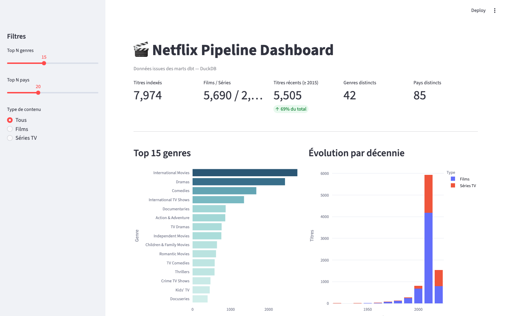
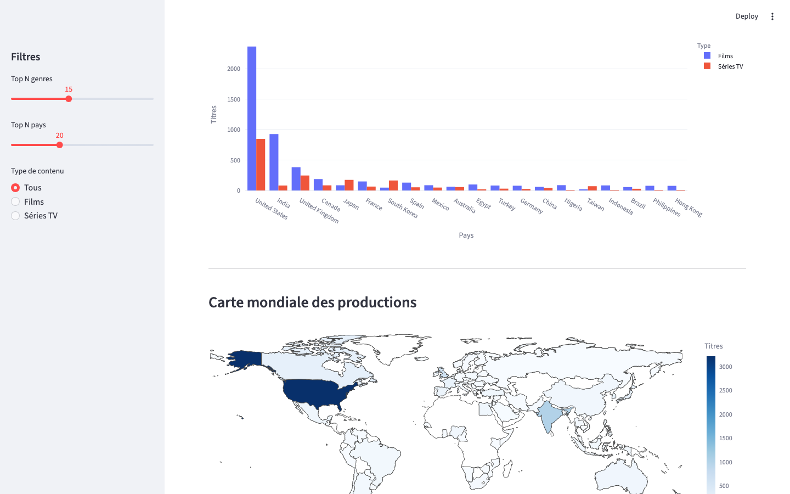
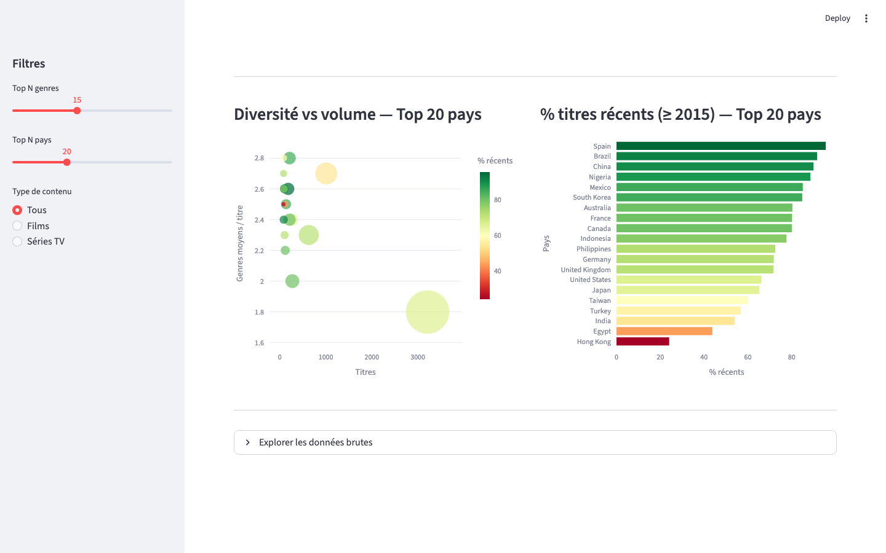

# Data Pipeline: CSV to SQLite with Reporting

## Table of Contents

- [Overview](#overview)
- [Project Structure](#project-structure)
- [Architecture](#architecture)
- [Quick Start](#quick-start)
  - [Python Pipeline (local)](#python-pipeline-local)
  - [dbt (local, DuckDB)](#dbt-local-duckdb)
  - [Airflow via Docker Compose](#airflow-via-docker-compose)
  - [Streamlit Dashboard (local)](#streamlit-dashboard-local)
- [Streamlit Dashboard](#streamlit-dashboard)
- [Usage](#usage)
- [Pipeline Steps](#pipeline-steps)
- [dbt Models](#dbt-models)
- [Example Queries](#example-queries)
- [Apache Airflow](#apache-airflow)
  - [DAG Overview](#dag-overview)
  - [Error Handling & Retries](#error-handling--retries)
  - [Airflow 3.x Compatibility](#airflow-3x-compatibility)
  - [Local Setup (without Docker)](#local-setup-without-docker)
  - [Environment Variables](#environment-variables)
  - [Triggering the DAG Manually](#triggering-the-dag-manually)
- [Tests](#tests)
- [Requirements](#requirements)
- [Customization](#customization)
- [License](#license)

## Overview

This project provides a learning-oriented ETL pipeline for Netflix titles data with four layers:
- Loads and cleans Netflix titles from a CSV file
- Stores cleaned data in SQLite and generates JSON + HTML reports
- Transforms data through a dbt/DuckDB model stack (staging → intermediate → marts)
- Visualises the marts in an interactive Streamlit dashboard (genres, decades, countries, world map)
- Orchestrates all steps via an Apache Airflow DAG with Slack notifications

## Project Structure

```
data-pipeline-csv-sqlite/
│
├── main.py                   # Main entry point to run the data pipeline
├── app.py                    # Streamlit dashboard (reads DuckDB marts)
├── conftest.py               # Pytest path setup (exposes dags/ to test runner)
├── requirements.txt          # Core Python dependencies (incl. streamlit + plotly)
├── requirements-dbt.txt      # Optional dependencies for dbt (local learning)
├── requirements-airflow.txt  # Optional dependencies for Apache Airflow
├── Dockerfile                # Extends apache/airflow:3.0.0 with pipeline deps
├── docker-compose.yml        # Airflow stack: postgres + init + webserver + scheduler
├── README.md                 # Project documentation
│
├── docs/
│   └── screenshots/          # Dashboard screenshots (generated by playwright)
│
├── dags/
│   └── netflix_pipeline_dag.py   # Airflow DAG (CSV → SQLite + dbt → Report)
│
├── data/
│   ├── netflix_titles.csv    # Raw input data (CSV)
│   ├── netflix.db            # SQLite database (output)
│   └── netflix.duckdb        # DuckDB database (dbt output)
│
├── outputs/
│   ├── cleaned_data.csv      # Cleaned CSV data (output)
│   ├── report.json           # Generated JSON report
│   └── report.html           # Generated HTML report
│
├── pipeline/
│   ├── loader.py             # Loads CSV data into a DataFrame
│   ├── clean.py              # Cleans and preprocesses the DataFrame
│   ├── db.py                 # Handles SQLite DB insertions and queries
│   └── report.py             # Generates JSON + HTML reports
│
├── tests/
│   ├── test_loader.py        # Unit tests — CSV loading
│   ├── test_clean.py         # Unit tests — data cleaning
│   ├── test_report.py        # Unit tests — report generation
│   ├── test_dag_tasks.py     # Unit tests — DAG task callables (error handling)
│   └── test_dag_structure.py # Structural tests — DAG graph, retries, timeouts
│
├── dbt/
│   ├── dbt_project.yml       # dbt project configuration
│   ├── profiles.yml          # Local DuckDB profile (for DBT_PROFILES_DIR)
│   ├── seeds/                # Input seed CSV for dbt (generated by main.py)
│   ├── snapshots/            # dbt snapshots (SCD type 2)
│   └── models/
│       ├── staging/
│       │   └── stg_netflix_titles.sql
│       ├── intermediate/
│       │   ├── int_netflix_titles_enriched.sql
│       │   └── int_netflix_genres_exploded.sql
│       └── marts/
│           ├── mart_titles_by_country.sql
│           ├── mart_titles_by_genre.sql
│           └── mart_titles_by_decade.sql
│
└── scripts/
    ├── run_dbt_local.sh      # One-command runner: pipeline → dbt seed/run/test
    └── setup_airflow.sh      # Apache Airflow installation and configuration
```

## Architecture

Three execution paths share the same `pipeline/` modules. Airflow orchestrates all of them; the Streamlit dashboard reads the final DuckDB marts.

### Full Data Flow

```
data/netflix_titles.csv
         │
         ▼
   pipeline/ (Python ETL)
   ┌──────────────────────────────────────────────────────┐
   │  loader.py → clean.py → db.py      → report.py      │
   └────────────────────────┬────────────┬────────────────┘
                            │            │
                   data/netflix.db  outputs/
                   (SQLite)         report.json · report.html
                            │
                    copy_to_dbt_seed (Airflow task)
                            │
                            ▼
              dbt/seeds/netflix_titles.csv
                            │
                            ▼  dbt + DuckDB
              ┌─────────────────────────────────────────┐
              │  staging (views)                        │
              │    └── stg_netflix_titles               │
              │                                         │
              │  intermediate (views)                   │
              │    ├── int_netflix_titles_enriched       │
              │    └── int_netflix_genres_exploded       │
              │                                         │
              │  marts (tables)                         │
              │    ├── mart_titles_by_country            │
              │    ├── mart_titles_by_genre              │
              │    └── mart_titles_by_decade             │
              └──────────────────┬──────────────────────┘
                                 │
                         data/netflix.duckdb
                                 │
                                 ▼
                    Streamlit dashboard (app.py)
                    http://localhost:8501
                    KPIs · genres · decades · map · scatter
```

```
Orchestration layer (Apache Airflow — @daily)
─────────────────────────────────────────────────────────────────────
load_csv ──▶ clean_data ──▶ insert_to_db ──▶ generate_report ──────────────┐
                 │                                                           ├──▶ summary ──▶ notify_slack
                 └──▶ copy_to_dbt_seed ──▶ dbt_seed ──▶ dbt_snapshot ──▶ dbt_run ──┘
```

### 1. Core Python Pipeline

```
data/netflix_titles.csv
         │
         ▼
  ┌─────────────┐
  │  loader.py  │  CSV → pandas DataFrame
  └──────┬──────┘
         │
         ▼
  ┌─────────────┐
  │   clean.py  │  Validate columns · parse dates · deduplicate · pandera schema
  └──────┬──────┘
         │
    ┌────┴────────────┐
    ▼                 ▼
┌────────┐    ┌─────────────┐
│ db.py  │    │  report.py  │
│        │    │             │
│SQLite  │    │ report.json │
│  .db   │    │ report.html │
└────────┘    └─────────────┘
```

### 2. Airflow DAG (`@daily`, Airflow 3.x)

```
                     ┌──────────────────────────────────────────────┐
load_csv ──▶ clean_data ──▶ insert_to_db ──▶ generate_report ──────────────┐
                  │                                                           ├──▶ summary ──▶ notify_slack
                  └──▶ copy_to_dbt_seed ──▶ dbt_seed ──▶ dbt_snapshot ──▶ dbt_run ──┘
                                                         (DuckDB)
```

Status is inferred from XComs (no ORM calls — Airflow 3.x compatible). `notify_slack` runs with `TriggerRule.ALL_DONE` and is silently skipped if `SLACK_WEBHOOK_URL` is unset.

### 3. dbt Layers (DuckDB)

```
dbt/seeds/netflix_titles.csv  ◀── populated by main.py or copy_to_dbt_seed
         │
         ▼  staging (views)
┌──────────────────────────┐
│   stg_netflix_titles     │  cast types · trim whitespace · filter null titles
└──────────────┬───────────┘
               │
               ▼  intermediate (views)
┌──────────────────────────────┬──────────────────────────────────┐
│ int_netflix_titles_enriched  │   int_netflix_genres_exploded    │
│ country_normalized · decade  │   one row per (title, genre)     │
│ is_recent · genre_count      │   via DuckDB unnest()            │
└──────────────┬───────────────┴────────────────┬─────────────────┘
               │                                 │
               ▼  marts (tables)                 ▼
┌─────────────────────┐   ┌──────────────────┐   ┌──────────────────────┐
│ mart_titles_by_     │   │ mart_titles_by_  │   │  mart_titles_by_     │
│ country             │   │ genre            │   │  decade              │
└─────────────────────┘   └──────────────────┘   └──────────────────────┘
```

## Quick Start

Three execution paths, from simplest to most complete:

| Path | Prerequisites | What it runs |
|---|---|---|
| Python pipeline | Python 3.9+ | ETL CSV → SQLite + reports |
| dbt (local) | Python + dbt-duckdb | DuckDB models (staging → marts) |
| Airflow (Docker) | Docker + Docker Compose | Orchestrated DAG + dbt branch |
| Streamlit dashboard | Python + dbt marts populated | Interactive visualisation of DuckDB marts |

### Python Pipeline (local)

```bash
git clone https://github.com/registesson/netflix-pipeline-csv-sqlite.git
cd netflix-pipeline-csv-sqlite

pip install -r requirements.txt
cp .env.example .env          # adjust paths if needed

python main.py
```

Outputs: `data/netflix.db`, `outputs/cleaned_data.csv`, `outputs/report.json`, `outputs/report.html`.

### dbt (local, DuckDB)

```bash
pip install -r requirements-dbt.txt

# Populate seeds from the Python pipeline
python main.py --cleaned-output dbt/seeds/netflix_titles.csv

# Run seed + run + test in one command
./scripts/run_dbt_local.sh
```

Or step by step:

```bash
cd dbt && export DBT_PROFILES_DIR=$(pwd)
dbt seed --full-refresh
dbt run --select stg_netflix_titles int_netflix_titles_enriched int_netflix_genres_exploded mart_titles_by_country mart_titles_by_genre mart_titles_by_decade
dbt test --select stg_netflix_titles int_netflix_titles_enriched int_netflix_genres_exploded mart_titles_by_country mart_titles_by_genre mart_titles_by_decade
```

### Airflow via Docker Compose

**Prerequisites:** Docker Desktop ≥ 4.x (or Docker Engine + Compose v2). At least 4 GB of RAM allocated to Docker is recommended.

#### Setup

```bash
# 1. Copy the env file and adjust paths or credentials if needed
cp .env.example .env

# 2. Build the custom image (extends apache/airflow:3.0.0 with pipeline deps)
docker compose build

# 3. Bring up all services
#    Startup order: postgres → airflow-init (DB migrate + user create) → webserver + scheduler
docker compose up -d
```

Wait ~30 seconds for `airflow-init` to complete, then open the web UI.

Web UI: **http://localhost:8088** — login `admin` / `admin`.

#### Daily operations

```bash
# Trigger the DAG manually (without waiting for @daily schedule)
docker compose exec webserver airflow dags trigger netflix_pipeline

# Follow scheduler logs in real time
docker compose logs -f scheduler

# Check the status of all containers
docker compose ps

# Stop all services (keeps volumes)
docker compose down

# Stop and remove all data (full reset)
docker compose down -v
```

#### Slack notifications

Uncomment `SLACK_WEBHOOK_URL` in `docker-compose.yml` (or add it to `.env`) and set your Incoming Webhook URL. The `notify_slack` task runs with `TriggerRule.ALL_DONE` — it posts pipeline metrics even on failure, and is silently skipped when the variable is unset.

#### Troubleshooting

| Symptom | Likely cause | Fix |
|---|---|---|
| Webserver not reachable on :8088 | `airflow-init` still running | Wait 30 s and retry; check `docker compose logs airflow-init` |
| Port 8088 already in use | Another process bound to 8088 | Change `"8088:8080"` to `"8089:8080"` in `docker-compose.yml` |
| `ModuleNotFoundError: pipeline` | Volume mount missing | Verify `./pipeline:/opt/airflow/pipeline` is in `docker-compose.yml` |
| DAG not visible in the UI | DAG parse error | Check `docker compose logs scheduler` for syntax errors |
| DuckDB file locked | Another process holds a write lock | Stop the local `streamlit run` or dbt process before triggering the DAG |

> **Note:** `data/`, `outputs/`, and `dbt/` are bind-mounted — files generated inside containers are immediately visible on the host.

### Streamlit Dashboard (local)

**Prerequisites:** dbt marts must be populated in `data/netflix.duckdb` (run `./scripts/run_dbt_local.sh` first).

```bash
streamlit run app.py
```

Opens at **http://localhost:8501**.

## Streamlit Dashboard

The dashboard reads directly from the DuckDB mart tables and requires no server beyond `streamlit run app.py`.



**KPI row** (top): total titles indexed, movies vs TV shows split, share of recent titles (≥ 2015), distinct genres, and distinct countries — all derived from `mart_titles_by_country` and `mart_titles_by_genre`.

**Sidebar filters** (left panel): adjustable sliders for top-N genres and top-N countries, plus a radio button to switch between all titles / movies only / TV shows only. All charts update reactively.



**Top countries bar chart** (grouped): movies vs TV shows per producing country, sourced from `mart_titles_by_country`. Filtered by the sidebar type selection.

**World choropleth** (`plotly.express.choropleth`): intensity reflects title count per country. Hover shows `title_count`, `movie_count`, `tv_show_count`, and `recent_titles_count`.



**Diversity vs volume scatter** (bottom-left): x = total titles, y = average genre count per title, bubble size = recent title count, color = % recent titles. Reveals which countries produce broadly vs. narrowly categorised content.

**% recent titles bar** (bottom-right): horizontal bar chart ranked by recency share, color-coded green → red. Spain and Brazil top the recent-content ranking; India and Hong Kong have proportionally older catalogues.

The **"Explorer les données brutes"** expander at the bottom lets you switch between all three mart tables and inspect raw rows.

## Usage

Run with optional flags and custom paths:

```bash
python main.py --show-examples
python main.py --if-exists append
python main.py --input data/netflix_titles.csv --cleaned-output outputs/cleaned_data.csv --db data/netflix.db --report outputs/report.json
```

## Pipeline Steps

1. **Loading** (`pipeline/loader.py`)
   - Loads the CSV into a pandas DataFrame.
2. **Cleaning** (`pipeline/clean.py`)
   - Validates required columns before processing (raises `ValueError` if missing)
   - Drops rows without a title
   - Parses `date_added` as datetime
   - Removes duplicates based on `title` and `date_added`
   - Validates types and value ranges via a `pandera` schema (errors logged as warnings — non-fatal)
3. **Database Insertion** (`pipeline/db.py`)
   - Inserts the cleaned DataFrame into a SQLite database (`netflix_titles` table)
   - Supports `--if-exists` mode: `replace`, `append`, or `fail`
   - Provides functions to run custom SQL queries and return results as DataFrames
4. **Reporting** (`pipeline/report.py`)
   - Generates JSON and HTML reports with:
     - Number of titles
     - Number of unique countries
     - Distribution by type (`Movie`, `TV Show`)
     - Top 10 countries by number of titles
     - Titles count by release year
     - Missing rate for `date_added`

## dbt Models

Three-layer architecture backed by DuckDB. Schema files are split per layer: `models/staging/schema.yml`, `models/intermediate/schema.yml`, `models/marts/schema.yml`.

### Staging — `models/staging/`

| Model | Materialization | Description |
|---|---|---|
| `stg_netflix_titles` | view | Casts types, trims text, filters rows with null titles |

Key columns: `show_id`, `title`, `type`, `country`, `release_year`, `date_added` (timestamp), `listed_in`, `description`.

### Intermediate — `models/intermediate/`

| Model | Materialization | Description |
|---|---|---|
| `int_netflix_titles_enriched` | view | One row per title — adds `country_normalized`, `decade`, `is_recent`, `genre_count`, `date_added_year` |
| `int_netflix_genres_exploded` | view | One row per (title, genre) pair — unnests `listed_in` via DuckDB `unnest(string_split(...))` |

### Marts — `models/marts/`

| Model | Materialization | Grain | Key metrics |
|---|---|---|---|
| `mart_titles_by_country` | table | One row per country | `title_count`, `movie_count`, `tv_show_count`, `recent_titles_count`, `avg_genre_count`, `min/max_release_year` |
| `mart_titles_by_genre` | table | One row per genre | `title_count`, `movie_count`, `tv_show_count`, `min/max_release_year` |
| `mart_titles_by_decade` | table | One row per decade | `title_count`, `movie_count`, `tv_show_count`, `country_count`, `avg_genre_count` |

### dbt Tests

**Generic tests** (defined in `schema.yml` per layer):

| Model | Column | Tests |
|---|---|---|
| `stg_netflix_titles` | `show_id` | `not_null`, `unique` |
| | `title`, `type`, `release_year` | `not_null` |
| | `type` | `accepted_values` (`Movie`, `TV Show`) |
| `int_netflix_titles_enriched` | `show_id` | `not_null`, `unique` |
| | `title`, `type`, `release_year`, `country_normalized`, `decade`, `is_recent` | `not_null` |
| | `type` | `accepted_values` (`Movie`, `TV Show`) |
| `int_netflix_genres_exploded` | `show_id`, `title`, `type`, `release_year`, `country_normalized`, `genre` | `not_null` |
| | `type` | `accepted_values` (`Movie`, `TV Show`) |
| `mart_titles_by_country` | `country` | `not_null`, `unique` |
| | `title_count`, `movie_count`, `tv_show_count`, `recent_titles_count`, `min/max_release_year` | `not_null` |
| `mart_titles_by_genre` | `genre` | `not_null`, `unique` |
| | `title_count`, `movie_count`, `tv_show_count`, `min/max_release_year` | `not_null` |
| `mart_titles_by_decade` | `decade` | `not_null`, `unique` |
| | `title_count`, `movie_count`, `tv_show_count`, `country_count` | `not_null` |

**Singular tests** (`dbt/tests/`):

| File | What it checks |
|---|---|
| `test_stg_release_year_range.sql` | `release_year` outside `[1900, current_year + 1]` |
| `test_int_decade_multiple.sql` | `decade` is a multiple of 10 |
| `test_int_genre_row_count.sql` | exploded row count ≥ staging row count |
| `test_mart_country_counts_consistent.sql` | `title_count = movie_count + tv_show_count` and `min_release_year ≤ max_release_year` |
| `test_mart_genre_counts_consistent.sql` | same consistency check at genre level |
| `test_mart_decade_counts_consistent.sql` | same consistency check at decade level |

Run all models and tests:

```bash
cd dbt
export DBT_PROFILES_DIR=$(pwd)
dbt seed --full-refresh
dbt run --select stg_netflix_titles int_netflix_titles_enriched int_netflix_genres_exploded mart_titles_by_country mart_titles_by_genre mart_titles_by_decade
dbt test --select stg_netflix_titles int_netflix_titles_enriched int_netflix_genres_exploded mart_titles_by_country mart_titles_by_genre mart_titles_by_decade
```

## Example Queries

Run with `python main.py --show-examples` to execute these queries against the SQLite database:

```sql
-- All titles from 2020
SELECT * FROM netflix_titles WHERE release_year = 2020;

-- Titles and their types
SELECT title, type FROM netflix_titles;

-- Movies released from 2020 onwards
SELECT * FROM netflix_titles WHERE type = 'Movie' AND release_year >= 2020;

-- Count of titles from Japan
SELECT COUNT(*) AS n FROM netflix_titles WHERE country = 'Japan';
```

## Apache Airflow

The `netflix_pipeline` DAG orchestrates the same steps as `main.py` on a daily schedule, with a parallel dbt branch.

### DAG Overview

```
load_csv >> clean_data >> insert_to_db     >> generate_report >> summary >> notify_slack
                       >> copy_to_dbt_seed >> dbt_seed >> dbt_snapshot >> dbt_run ──┘
```

| Task | Description |
|---|---|
| `load_csv` | Validates and loads the source CSV |
| `clean_data` | Cleans data and saves a timestamped CSV |
| `insert_to_db` | Inserts into SQLite with configurable `IF_EXISTS` mode |
| `generate_report` | Generates timestamped JSON and HTML reports |
| `copy_to_dbt_seed` | Copies the cleaned CSV to `dbt/seeds/` |
| `dbt_seed` | Loads seeds into DuckDB |
| `dbt_snapshot` | Applies SCD type 2 snapshots |
| `dbt_run` | Runs staging and mart models |
| `summary` | Logs pipeline metrics from XComs |
| `notify_slack` | Posts pipeline metrics to Slack via Incoming Webhook |

### Error Handling & Retries

Each task has a retry strategy and timeout tailored to its nature:

| Task | Retries | Retry delay | Timeout | Notes |
|---|---|---|---|---|
| `load_csv` | 2 | 30s | 5 min | Source file may not be available yet |
| `clean_data` | 1 | 1 min | 10 min | Deterministic — retries rarely help |
| `insert_to_db` | 3 | 2 min (exponential) | 10 min | Absorbs SQLite lock contention |
| `generate_report` | 2 | 1 min | 5 min | |
| `copy_to_dbt_seed` | 2 | 30s | 3 min | |
| `dbt_seed/snapshot/run` | 2 | 3 min | 15 min | dbt initializes its environment on startup |
| `summary` | 0 | — | 2 min | `TriggerRule.ALL_DONE` — runs even if a branch fails |
| `notify_slack` | 1 | 30s | 2 min | `TriggerRule.ALL_DONE` — notifies even on failure |

An `on_failure_callback` is registered on all tasks and logs the DAG name, task, run ID, attempt number, and exception on each failure.

### Airflow 3.x Compatibility

- `dag_run.get_task_instances()` no longer exists in Airflow 3.x — pipeline status is inferred from XComs (`notify_slack` considers the run successful if `row_count_raw`, `row_count_cleaned`, and `report_path` are all present).
- `context["dag_run"]` is a Pydantic model from the Task SDK: it exposes `dag_id`, `run_id`, `state`, and data interval fields, but no ORM methods.
- The `pipeline/` module must be mounted at `/opt/airflow/pipeline` in the Docker container so that `PROJECT_ROOT` (parent of `dags/`) resolves it correctly.

### Local Setup (without Docker)

```bash
pip install -r requirements-airflow.txt

export AIRFLOW_HOME=$(pwd)/.airflow
airflow db migrate
airflow users create --username admin --password admin \
    --firstname Admin --lastname Netflix --role Admin --email admin@example.com
```

Or use the one-command helper:

```bash
./scripts/setup_airflow.sh
```

In two separate terminals:

```bash
# Terminal 1 — Webserver
export AIRFLOW_HOME=$(pwd)/.airflow
airflow webserver --port 8080

# Terminal 2 — Scheduler
export AIRFLOW_HOME=$(pwd)/.airflow
airflow scheduler
```

Web UI: **http://localhost:8080** (login: `admin` / `admin`)

### Environment Variables

| Variable | Default value |
|---|---|
| `INPUT_PATH` | `data/netflix_titles.csv` |
| `CLEANED_OUTPUT` | `outputs/cleaned_data.csv` |
| `DB_PATH` | `data/netflix.db` |
| `REPORT_PATH` | `outputs/report.json` |
| `IF_EXISTS` | `replace` |
| `SLACK_WEBHOOK_URL` | *(unset — notification silently skipped)* |

### Triggering the DAG Manually

```bash
export AIRFLOW_HOME=$(pwd)/.airflow
airflow dags trigger netflix_pipeline
```

## Tests

```bash
pytest      # run all tests
pytest -v   # verbose output
```

| File | What it tests |
|---|---|
| `test_loader.py` | CSV loading |
| `test_clean.py` | Data cleaning |
| `test_report.py` | Report generation |
| `test_dag_tasks.py` | DAG task callables: business errors, XCom validation, happy paths |
| `test_dag_structure.py` | DAG structure: dependency graph, retries, timeouts, callbacks |

DAG tests do not require an Airflow infrastructure: callables are invoked directly with a mocked context, and path variables are overridden via `monkeypatch`.

## Requirements

- Python 3.9+
- pandas >= 2.0.0, pandera >= 0.18.0, python-dotenv, jinja2
- Optional dbt track: `pip install -r requirements-dbt.txt` (dbt-core + dbt-duckdb)
- Optional Airflow track: `pip install -r requirements-airflow.txt` (apache-airflow >= 3.0.0)
- Optional dashboard: streamlit >= 1.57.0, plotly >= 6.7.0, duckdb >= 1.5.2 (all in `requirements.txt`)

## Customization

- To use a different input file, use `--input` in `main.py`.
- To add more cleaning steps, edit `pipeline/clean.py`.
- To extend reporting, modify `pipeline/report.py`.

## License

MIT License
